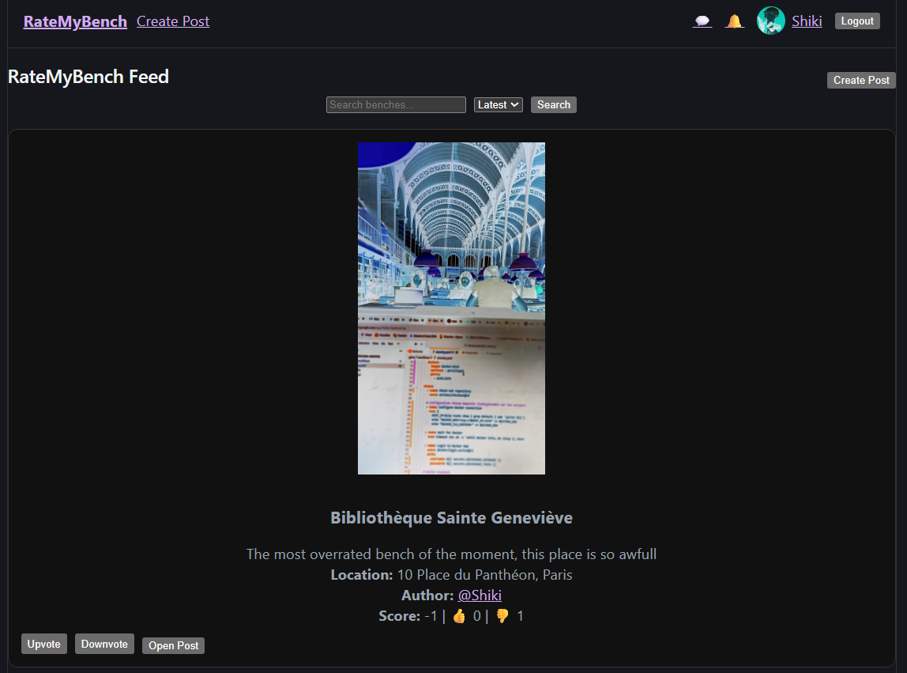
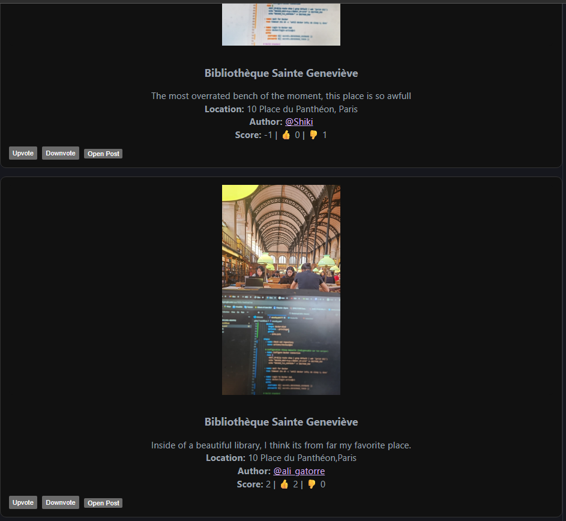
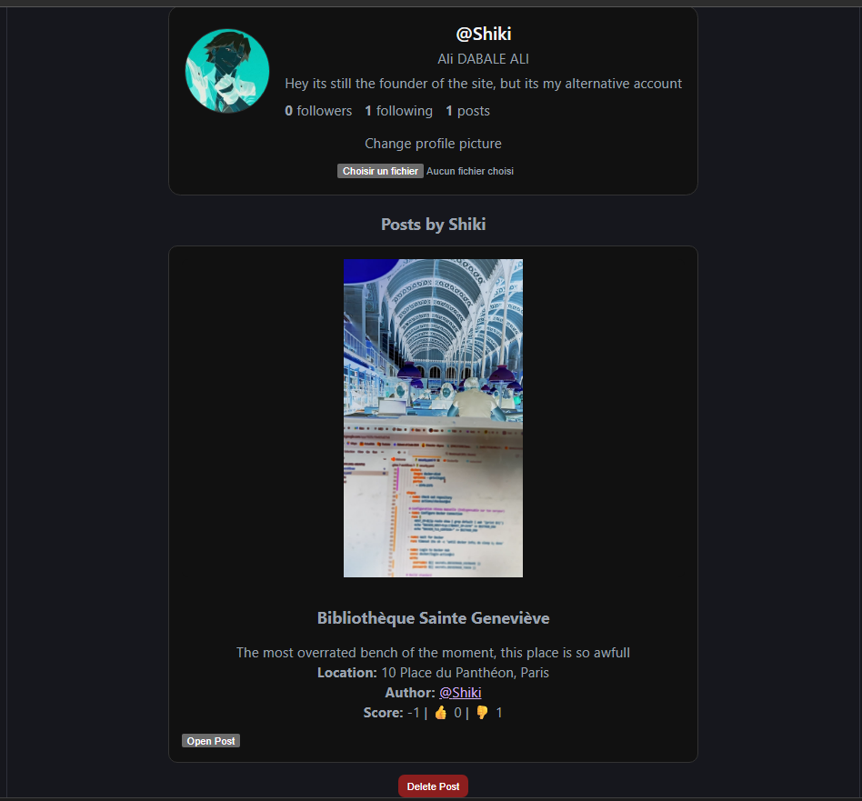
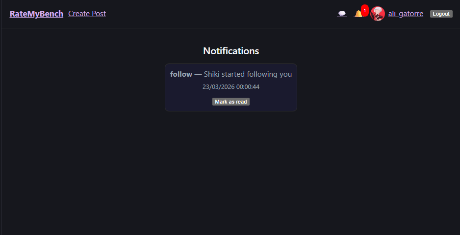
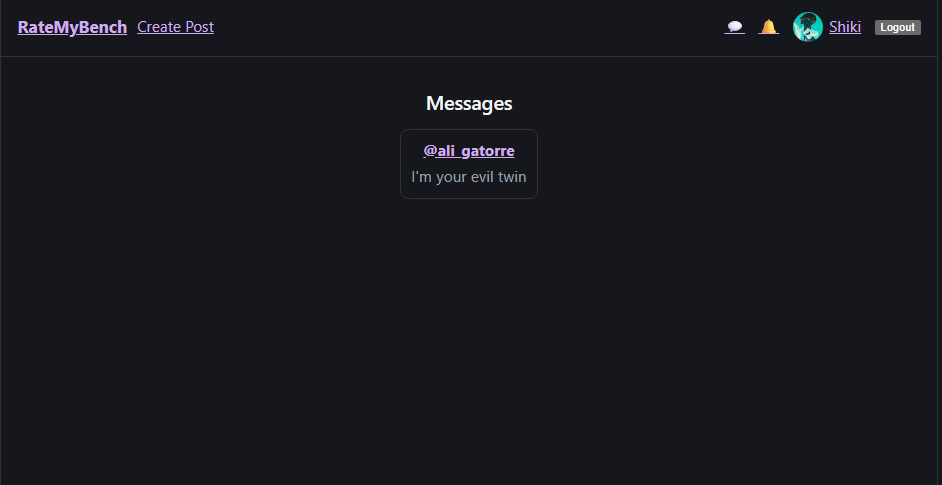
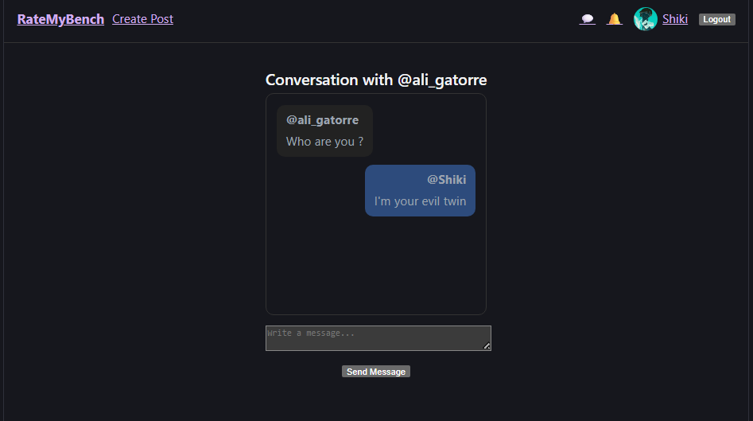
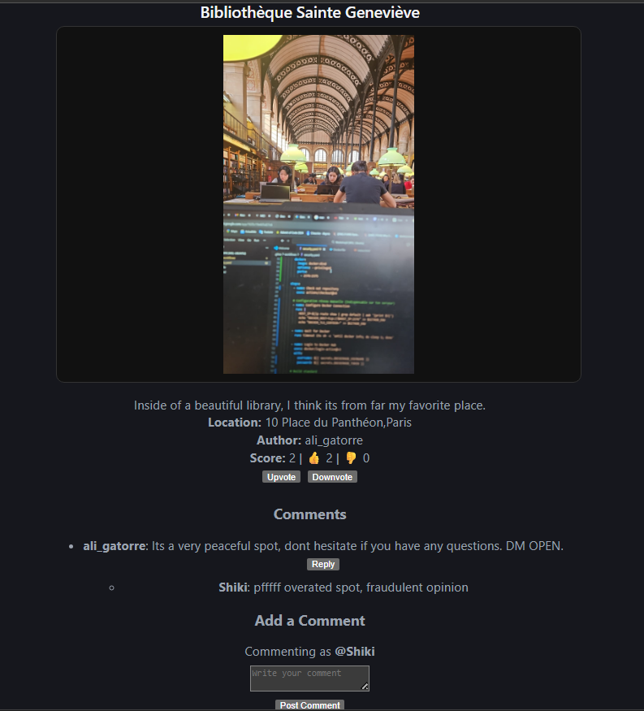

# RateMyBench

## Description

RateMyBench est une application web permettant aux utilisateurs de partager, noter et commenter des lieux (appelés ici "benches"). L'objectif est de proposer une plateforme simple pour découvrir des spots, donner son avis et interagir avec d'autres utilisateurs.

Ce projet a été réalisé dans un contexte DevOps avec une architecture microservices complète, afin de se rapprocher d'un environnement réel.

---

## Fonctionnalités principales

- Feed principal avec publication de posts (bench)
- Système de vote (upvote / downvote)
- Page de détail avec commentaires et réponses
- Création de compte et authentification
- Profil utilisateur
- sytèmes de follow
- notifications
- Messagerie privée entre utilisateurs

---

## Aperçu de l'application

### Feed principal



### Profil utilisateur


### Notifications


### Messagerie


### Conversation


### Commentaires


---

## Technology Stack

### Frontend
- React
- Vite
- Port : 5173

### Backend
- Node.js (Express)
- PostgreSQL
- pg

### DevOps
- Docker
- Docker Compose
- Gitea Actions
- Trivy

---

## Architecture

L'application repose sur une architecture microservices :

- api1 : gestion des posts
- api2 : gestion des commentaires
- api3 : gestion des utilisateurs
- api4 : gestion des messages

Chaque service possède sa propre base PostgreSQL.

---

## Installation

### Cloner le projet

```bash
git clone https://github.com/TON-USERNAME/team-04-rate-my-bench.git
cd team-04-rate-my-bench
```

### Lancer avec Docker

```bash
docker compose up --build
```

---

## Accès

- Frontend : http://localhost:5173
- API1 : http://localhost:5001
- API2 : http://localhost:5002
- API3 : http://localhost:5003
- API4 : http://localhost:5004

---

## Variables d'environnement

Exemple pour API3 :

```env
API3_DB_HOST=db3
API3_DB_PORT=5432
API3_DB_NAME=userdb
API3_DB_USER=userapi
API3_DB_PASSWORD=password
PORT=5003
```

---

## Fonctionnement

1. Le frontend React envoie des requêtes aux APIs
2. Chaque API traite la logique métier
3. Les données sont stockées dans PostgreSQL
4. Les résultats sont renvoyés au frontend

---

## Structure

- frontend/
- api1/
- api2/
- api3/
- api4/
- docker-compose.yml

---

## Sécurité

- Isolation réseau Docker
- Scan Trivy
- Variables d'environnement

---

## CI/CD

- Build Docker
- Scan sécurité
- Push DockerHub

---

## Difficultés rencontrées

- communication entre conteneurs
- configuration PostgreSQL
- gestion des variables
- CI/CD

---

## Améliorations possibles

- authentification JWT
- notifications
- déploiement cloud
- monitoring

---

## Auteur

Projet réalisé dans un cadre académique DevOps.
